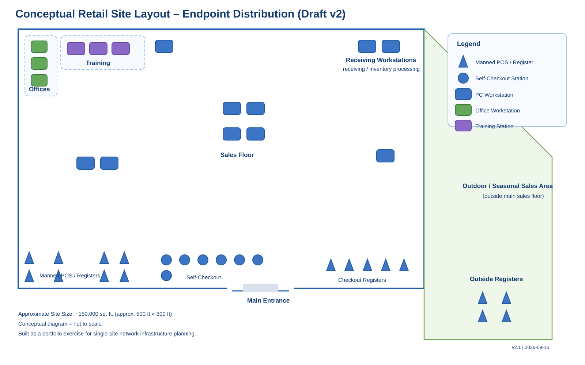

# Diagrams

This folder contains the physical and logical network diagrams for the project.

## Current Draft

### 01 - Site Layout / Endpoint Distribution

This rough draft establishes the physical site footprint and endpoint distribution before MDF, IDF, wireless access point, camera, and cabling placement are added.

Key assumptions:
- Approximate site size: ~150,000 sq. ft. (about 500 ft x 300 ft)
- Main interior sales floor is separated from the outdoor / seasonal sales area
- Top-right workstations are associated with receiving and inventory processing
- Triangles represent manned POS/registers
- Circles represent self-checkout stations
- Rounded blue rectangles represent PC workstations
- Green workstations represent office stations
- Purple workstations represent training stations
- Four registers in the exterior sales area are designated as outside registers

The diagram is conceptual and not to scale.
